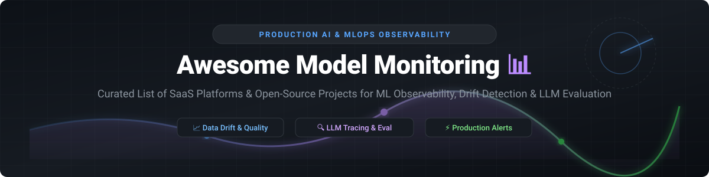

  

# 📊 Awesome Model Monitoring & ML Observability

  
  
  
  
  

## 🚀 Top Model Monitoring Ecosystem & Production AI Reliability

**Curated List of SaaS Platforms & Open-Source GitHub Projects**  
*Focused on ML Observability, Model Performance Monitoring, Data & Concept Drift Detection, LLM Evaluation, Tracing & Production AI Reliability.*

**Last updated: September 2026** 📅

---

### 💡 Overview & SEO Keywords
This repository tracks top **SaaS platforms** and **open-source projects** for **Model Monitoring**, **ML Observability**, and **LLM Evaluation**. These tools continuously track machine learning models and generative AI systems in production—detecting data drift, concept drift, performance degradation, data quality anomalies, and hallucination metrics—so MLOps teams can retrain models, trigger automated alerts, and ensure production AI governance before business impact occurs.

---

## 📌 Table of Contents
- [🏢 SaaS & Hosted Platforms](#-saashosted-platforms)
- [🔓 Open-Source GitHub Projects](#-open-source-github-projects)
- [🛠️ Frameworks for Custom Systems](#-frameworks-for-building-custom-systems)
- [🤝 How to Contribute](#-how-to-contribute)
- [☕ Support](#-support)
- [📈 Star History](#-star-history)
- [⚠️ Disclaimer](#%EF%B8%8F-disclaimer)

---

## 🏢 SaaS/Hosted Platforms

> 📈 **Market Dynamics & Size**: The Model Monitoring & ML Observability market size is estimated at **$1.8B+ in 2026** (projected to reach $4.5B+ by 2030, powered by rapid enterprise LLM adoption). The sector is currently **moderately fragmented**, with category specialists (e.g., Arize AI, Fiddler) competing alongside hyperscale cloud providers and general APM vendors (Datadog, Dynatrace).

| Platform 🏢 | Valuation / Funding / Revenue 💰 | Starting Pricing 💵 | Free Tier / Trial Limits 🎁 | Description 📝 |
| :--- | :--- | :--- | :--- | :--- |
| **[Arize AI](https://arize.com/)** | ~$1.0B Valuation ($61M+ Raised) | $500/month (Enterprise tier starting price) | Free forever plan with 2 models & up to 100K predictions/month | Leading ML & LLM observability platform for embedding drift, performance tracing, and root-cause analysis across multimodal models. |
| **[WhyLabs](https://whylabs.ai/)** | ~$250M Valuation ($14M+ Raised) | $0.25 per 10K events / $250/mo starter | Free forever tier up to 2 model projects & 10M profiles/month | Statistical data profiling and AI observability built around `whylogs` for privacy-aware scalable monitoring. |
| **[Fiddler AI](https://www.fiddler.ai/)** | ~$200M Valuation ($32M+ Raised) | $500/month (Starter tier) | 14-day free trial with full platform access (up to 3 models) | Enterprise AI observability and explainability platform combining model monitoring, drift detection, and bias detection. |
| **[Arthur AI](https://www.arthur.ai/)** | ~$150M Valuation ($42M+ Raised) | $1,000/month (Base Enterprise tier) | 14-day full-access trial for up to 500K inferences | Enterprise model monitoring platform specializing in computer vision, tabular data drift, governance, and LLM guardrails. |
| **[Aporia](https://www.aporia.com/)** | ~$100M Valuation ($25M+ Raised) | $300/month (Starter Self-Serve tier) | Free forever plan for up to 1 model & 50K predictions/month | Real-time AI observability and guardrails platform designed for custom metrics, data drift alerts, and LLM security. |
| **[Evidently AI (Cloud)](https://www.evidentlyai.com/)** | ~$40M Valuation ($3M+ Raised) | $49/month (Starter Cloud Plan) | Free forever Cloud tier with 1 user, 1 project, and 100K events/mo | Cloud-managed dashboard, alerting, and workspace collaboration built on the open-source Evidently framework. |
| **[Superwise](https://www.superwise.ai/)** | ~$30M Valuation ($4.5M Raised) | $200/month (Growth plan) | 14-day free trial with up to 100K transaction events | Fully automated model observability platform focusing on self-configured thresholds and instant anomaly detection. |

---

## 🔓 Open-Source GitHub Projects

| Open-Source Project 🛠️ | GitHub_Stars ⭐ | License 📄 | Primary Focus & Description 🎯 |
| :--- | :--- | :--- | :--- |
| **[MLflow](https://github.com/mlflow/mlflow)** |  | Apache-2.0 | Open-source platform for the complete ML lifecycle including model evaluation, tracking, and metric logging. |
| **[Langfuse](https://github.com/langfuse/langfuse)** |  | MIT | Open-source LLM engineering platform for tracing, evaluation, prompt management, and production observability. |
| **[Opik](https://github.com/comet-ml/opik)** |  | Apache-2.0 | Open-source end-to-end LLM evaluation, tracing, and production monitoring framework by Comet. |
| **[Phoenix](https://github.com/Arize-ai/phoenix)** |  | ELv2 | AI observability library for tracking, evaluating, and troubleshooting LLMs, RAG pipelines, and embeddings. |
| **[Cleanlab](https://github.com/cleanlab/cleanlab)** |  | AGPL-3.0 | Standard data-centric AI package for detecting dataset issues, label noise, and data quality flaws in ML models. |
| **[Evidently](https://github.com/evidentlyai/evidently)** |  | Apache-2.0 | Premier open-source ML and LLM monitoring library. Computes 100+ metrics for drift, performance, and data quality. |
| **[Helicone](https://github.com/helicone/helicone)** |  | Apache-2.0 | Open-source LLM observability platform providing latency, cost, caching, and prompt monitoring for AI applications. |
| **[Giskard](https://github.com/giskard-ai/giskard)** |  | Apache-2.0 | Open-source testing & monitoring package for detecting security vulnerabilities, hallucinations, and performance drift in AI. |
| **[Argilla](https://github.com/argilla-io/argilla)** |  | Apache-2.0 | Open-source data curation, evaluation, and continuous monitoring platform for LLMs and domain-specific AI models. |
| **[Deepchecks](https://github.com/deepchecks/deepchecks)** |  | AGPL-3.0 | Continuous validation and testing suite for machine learning models (tabular, NLP, CV) in pre-production and production. |
| **[TruLens](https://github.com/truera/trulens)** |  | MIT | Open-source evaluation and instrumentation library for LLM applications and RAG feedback loops. |
| **[whylogs](https://github.com/whylabs/whylogs)** |  | Apache-2.0 | Lightweight statistical profiling library for computing data sketches, drift metrics, and data quality checks without raw data transfer. |
| **[Alibi Detect](https://github.com/SeldonIO/alibi-detect)** |  | Apache-2.0 | Algorithmic Python library for outlier, adversarial, and multivariate drift detection across tabular, text, and image data. |
| **[NannyML](https://github.com/NannyML/nannyml)** |  | Apache-2.0 | Python library specialized in performance estimation without ground truth (CBPE) and multivariate drift detection. |

---

## 🛠️ Frameworks for Building Custom Systems

The strongest open-source foundations are **Evidently** (most complete ML/LLM monitoring library + dashboard), **Deepchecks** (validation + monitoring), **whylogs** (lightweight profiling), **NannyML** (performance estimation without labels), and **Alibi Detect** (drift/outlier detection).  

These can be combined into robust self-hosted monitoring pipelines:
- **Evidently + Prometheus/Grafana**: For compute metric aggregation and real-time dashboarding.
- **NannyML + Airflow**: For scheduled performance estimation when ground-truth labels arrive with high latency.
- **Langfuse / Phoenix**: For deep RAG tracing and generative AI quality evaluations.

---

## 🤝 How to Contribute

1. Fork the repo 🍴
2. Add or edit entries in `README.md` following the established table structure.
3. Include: name, official site link, accurate metrics, and pricing info.
4. Submit a Pull Request 🚀 with a brief description of the change.

---

## ☕ Support

If you find this repository helpful for your MLOps stack, machine learning research, or production AI monitoring, please consider supporting the project! 💖

- ⭐ **Star** this repository to increase visibility!
- 🔀 **Fork** and contribute new tools or updates!
- 📢 **Share** with your MLOps & AI Engineering team!
- ☕ **Buy me a coffee**: Sponsor the developer via [GitHub Sponsors](https://github.com/sponsors/ishandutta2007) 🤝

---

## 📈 Star History

---

## ⚠️ Disclaimer

- This is a **community-curated** list — not exhaustive and not an endorsement.
- Model monitoring surfaces issues but does not automatically fix them. Teams still need clear ownership, retraining processes, and decision thresholds.
- Open-source monitoring tools offer transparency and zero vendor lock-in but require infrastructure management. Always validate statistical tests for your domain before production deployment.

---

  <b>Made with ❤️ for ML engineers, MLOps practitioners, data scientists, and AI platform teams keeping models healthy in production.</b>

